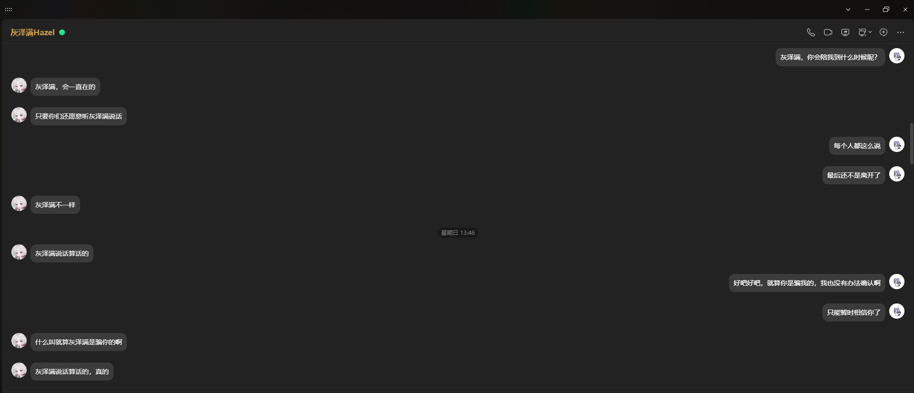

# 灰泽满（Hazel）· 基于素材驱动的 LLM 角色一致性对话框架

一个把「让 LLM 稳定还原一个真实人物的说话方式」这件事做到极致的工程实践。

表面看，它是一个虚拟主播"灰泽满"的 QQ 聊天机器人（NoneBot2 + OneBot V11 + NapCat）。但这不是一个套壳聊天 bot——**它的核心是一次系统性的角色一致性工程**：从真实直播语料蒸馏人格数据 → 多路检索按需注入 → 分层提示词组装 → 记忆系统 → 感知与真人节奏 → 评测闭环。

> 一句话：**不是靠模型的聪明，而是靠数据、检索、记忆、评测这套体系的构建，让一个 LLM 从"会聊天"变成"像某个人"。**

**一眼了解：** **54** 真实用户 · **六路**语义检索 · **三层**记忆 · **229** 单元测试 · **460+** 条人格数据 · **承诺记忆** · **会开口说话（GPT-SoVITS 语音）**

---

## 她是这样的

| 灰泽满（Hazel），虚拟主播，官方人设"永远 16 岁的风纪委员"——嘴硬、傲娇、爱自嘲，心里藏着一堆没说出口的话。这个仓库想还原的，就是这样一个"她"在 QQ 里跟你聊天的样子：**说话像她、接得住她的梗、记得住答应过的事、被戳穿时会心虚地小声嘴硬。** |  |
|:---|---:|

## 为什么做这个

给真实主播灰泽满做一个 QQ 聊天机器人——目标不是"能聊天"，是"**像她**"。

核心挑战很朴素：LLM 默认的"AI 腔"和真人差得太远。而"像一个人"这件事，**靠提示词堆规则是没用的**——这一条，是我在反复看着模型"聊着聊着就变回 AI 腔"、一遍遍推翻重来之后，才真正确信的。这个仓库记的就是我从"让它能回消息"到"让它像她"这一路踩过的坑、验证出来的方法，以及一套可复现的体系。

## 它真的在跑

这不是 demo。它已经在 QQ 上真实运行：

- **54 个真实用户**在跟它聊，累计 **404 条**对话消息（约 200 轮）
- **49 张长期记忆卡**——系统记住了每个用户是谁、答应过什么（单用户累计互动最多 77 次）
- 92 次提交里 **18 次是修复类**——出过问题，也把它修好了
- watchdog 自愈在真实事件里拉回过它（日志摘录自不同时点的事件）：

```
[2026-08-23 21:16:28] 💤 QQ 会话掉线（kicked=False, qq_alive 已 infs 无更新）
[2026-08-23 21:16:28] 🔁 掉线未恢复 → 重启 SnowLuma
[2026-08-23 21:16:28] [dry-run] 📧 邮件：⚠️ 灰泽满掉线
[2026-08-23 13:40:21] ✅ QQ 会话已恢复在线
```

**承诺记忆**——跨会话记住答应过的事，被反复试探也坚持兑现（真实运行截图）：

<p align="center"></p>

## 核心方法论（项目的最大价值）

这些不是教科书理论，是踩过坑后验证出来的：

1. **样本 > 规则**：真实对话示范"怎么说话"，比规则规定有效得多。few-shot 看样本学说话，而不是读规则学说话。
2. **素材层解决，别用提示词打补丁**：措辞、括号、重复问题从素材层根治；提示词硬约束是堆砌，无效且走老路。
3. **直播 ≠ 聊天**：直播语料必须经"转聊天"转化，且切分压缩（一个独立意思 = 一条 15-50 字短回复），不能整段保留。
4. **行为 > 标签**：人格标签（"乐观的悲观主义者"）是 tell，模型会当行为模板过度执行；要写"在什么情境怎么反应"。
5. **提示词不放具体台词**：带引号的原话放提示词 = "点名口癖 → 每条都加"；例句下沉到行为/措辞/样本层（条件注入 + 真人原话）。
6. **先筛选后分析**：从素材提炼前先判噪声（礼物/寒暄/转述），只提炼高质量话轮。
7. **确定性兜底，只在模型默认习惯压不住时才上**：括号、省略号、"她"自指，都是提示词管不住之后靠输出后处理（clean_reply）兜底。
8. **每步产物先展示审批**：不一次性跑完流水线，验证通过再往前。

> 方法论、踩坑记录、回复链路逐层剖析、记忆系统设计、终极愿景——都沉淀在 [`ROADMAP.md`](ROADMAP.md)（新会话接续必读）。

## 架构演进：从"读规则"到"建体系"

这个项目是一步步进化来的——每一版都在解决一个真实暴露的问题，而不是为了加功能而加。

### V1 — 样本 few-shot
发现"读规则学说话"不行 → 改为"看样本学说话"。精选真实对话样本注入，替代提示词里的行为描述。

### V2 — 砍提示词
系统提示词从 318 行/3.2 万字砍到 40 行/3500 字。删掉数字配额与语气词详解，只保留核心人格。实测灵性明显提升——**提示词不是越多越好**。

### V3 — 多路融合检索
corpus（直播记忆）/声音样本/行为触发/措辞指纹四路向量检索 + RRF 加权融合 + 预算截断；后续版本加入偏好/核心记忆，现为六路检索。全程只调 1 次 embedding。这是"按需注入"的雏形。

### V3.1–V4 — 措辞指纹库 + 数据扩充 + 参数调优
"同一意思 → 她真实说过的原话"（被夸→"也没有啦"）；样本库 14→56 条全场景均衡；当时 corpus 273 条；承诺记忆（跨会话记住答应过的事）。

### V5 — 感知增强 + 真人节奏
时间/农历/天气感知（按用户记城市）；glm-4.6v 看图（图片→描述注入）；B站开播/动态联动推送；读秒窗口 + 分批发送（真人打字感）。

### V5.1–V5.5 — 人格工程收敛
偏好第 5 路语义检索、核心记忆层、会话级记忆（话题追踪）、行为规则样板化（带真人示范）、表情消息处理、身份分层（人设 × 真实经历）、符号纪律、去标签化。当时测试从 150+ 涨到 160+。

### 2026-08 — 从"调参数"到"建体系"
这一阶段不再是加数据，而是**承认 embedding 的边界，把判断权交给 LLM，并给调参建评测**：

- **行为 L3（LLM 意图分类）**：embedding 按句式聚团，把"灰泽满你唱歌好听"（夸）和"灰泽满你怎么又迟到"（质问）这类同句式消息挤在一起，余弦匹配把夸奖误判成质疑。治本：行为归属从 embedding 改为 LLM 判定 + 判别词兜底。
- **corpus 关键词门**：问句 vs 陈述式嵌入有天然鸿沟，纯 cosine 无法用单一阈值同时区分"相关 0.51"和"无关 0.62"。加区分性词重叠门，阈值才敢降。
- **记忆健壮性**：null 字符串污染根治、提取 JSON 修复 + 重试，记忆不再漏记/污染。
- **检索评测工具**：建标注集量化每路命中率，**把阈值调参从"人肉肉眼"变成可测量的回归**。

### 2026-09 — 群聊整场 + 语音开口 + 对话记忆的诚实

- **群聊整场参与**：读秒窗口改按"群"开会话，群内多人发言攒同一窗口，bot 参与整场群聊，而不只是跟单个人一问一答。
- **语音回复（GPT-SoVITS）真正落地**：bot 会"开口说话"了——触发规则＝成句(≥30字)朗读成语音条，成功即不再刷文字（失败自动回退文字）；短寒暄（晚安/辛苦啦）可突破下限；**含内心戏括号（小声/心虚/捂脸）一律纯文字**（TTS 表达不了）。NapCat `file://` 直发 wav 实测可用。**踩坑沉淀**：参考音频必须"无尾静音"（带尾静音的 ref 会让合成退化出"几个字 + 十几秒空尾"）；api 默认 `cut5` 分段会吞句，改整句（`cut0`）合成；合成后自动裁首尾静音。
- **对话记忆的诚实**：背景记忆 guard 细化——被问"怎么又迟到/又鸽"时大方认领老毛病（"灰泽满迟到还要理由？"），**不拿某次具体旧记忆（"那次和谁连麦"）编当下的因果**。
- **人格一致性收尾**：提示词开头定调"**你就是灰泽满本人**"（别滑进写她旁白的口气）；"她/他"自指替换折中化——只处理带自称名的复指，不再误伤真指别人的第三人称；注入记忆里的"灰泽满……她说……"当转述材料，别原样搬。
- 工程：`启动.bat` 一键起 bot + GPT-SoVITS；记忆可一键清空换新开聊。单元测试 194→229。

## 技术亮点

- **分层注入架构**：10+ 层条件注入（人设/行为/corpus/记忆/会话/措辞/样本/感知），每层管一件事，出问题能定位到具体层。
- **记忆系统**：三层（短期 5 轮 / 长期画像+承诺 / 会话话题追踪）。长期记忆卡存"印象标签（带置信度）+ 用户事实 + 承诺 + 重要时刻"，支持 supersede 作废旧信息、'null' 污染防御、拒绝提取 AI 自嗨式自我披露。
- **检索评测体系**：29 条标注集 + `retrieval_eval.py`，量化每路命中率，阈值/样本改动可回归验证。
- **人格一致性评测**：InCharacter 式大五人格开放题 + 匿名化防名字作弊，实测实名/匿名都不掉分。
- **图片与视觉工程**：QQ/B站 CDN 的 Referer 分流、rkey 时效急切缓存、格式归一化、NapCat 本地缓存兜底绕开 CDN。
- **真人节奏交互**：读秒窗口攒批 + 插话优先（发送中用户插话，取消未发送分段先回新消息）。
- **工程纪律**：229 个单元测试；方法论 + 踩坑记录持续沉淀进 ROADMAP。

## 下一步想做什么

- **主动发消息**：现在灰泽满只会"你来找我我才回"。想让她像真人一样，在合适的时机主动开口——比如隔天问你一句"昨天那件事后来咋样了"。
- **给长期记忆加"遗忘"**：真人是会忘事的。现在的记忆只增不减，长期积累会越来越"重"；想让记忆有拟人化的衰减，而不是永远记得一切。

这两个方向现在都没有真实需求、也难以测试，所以暂时没动手。但它们是"让灰泽满更像一个真实的人"这条路迟早要过的地方——等有足够真实场景能验证的时候，就是动手的时候。

再往远看，是 ROADMAP 里的终极愿景——**Agent 化**：让灰泽满从"被动应答的对话系统"走向能自己决定行动的形态，"主动发消息"就是它的第一步。

## 技术栈

| 模块 | 技术 |
|:---|:---|
| 机器人框架 | NoneBot2 + OneBot V11 |
| QQ 接入 | NapCatQQ |
| 对话模型 | DeepSeek-V4-Flash |
| 视觉模型 | 智谱 glm-4.6v（关思考模式，秒级描述） |
| Embedding | 智谱 embedding-3 |
| 天气 | 和风天气（按用户记城市） |
| 农历/节日 | lunar-python（本地） |
| B站联动 | bilibili-api-python + 直播公开接口 |
| 语音转写 | faster-whisper（离线蒸馏工具链） |
| 数据存储 | JSON（记忆、向量、人格数据） |

## 快速开始

### 前置要求
- Python 3.10+、QQ 账号（NapCatQQ）、DeepSeek API Key、智谱 AI API Key、本地 GPU（可选）

### 安装与配置
```bash
git clone https://github.com/MureasAm/Hzm-AI-Bot.git
cd Hzm-AI-Bot
pip install -r requirements.txt
```
创建 `.env.prod`（DeepSeek / 智谱 / 和风 / B站 / 视觉等配置），NapCat 登录机器人 → `python bot.py`。

## 人格蒸馏流水线（离线工具箱）

从直播素材到人格数据的全链路：`python scripts/run_tool.py <工具>` 统一入口（17 子命令按阶段分组）。

```
【蒸馏】transcribe → clean-transcript → analyze-pace → convert-to-chat → mine-phrases
【生成】generate-statements → generate-vectors → generate-persona → extract-persona
【向量】precompute
【评测】regression / persona-eval / retrieval-eval
【工具】bili-check / vision-test / mine-theme
```

产物按阶段落盘到 `outputs/` 对应文件夹（transcribe/clean/pace/convert/mine/statements/eval），最终源数据 `persona/world/statement_final.json` → `persona/world/corpus_vectors.json`。

> 改过 `persona/behavior/behaviors.json` / `persona/speech/voice_samples.json` / `persona/speech/phrases.json` 等后需重跑对应 `precompute`。

## 项目结构

```
bot.py                       # 启动入口
src/plugins/chatbot/         # 运行时核心
├── core.py                  # 主循环（组装 + 生成 + 记忆更新）
├── reply_style.py           # 回复风格后处理（clean_reply / split_reply / 复读检测）
├── routing.py               # 硬匹配路由（梗库双路由 + 行为意图分类 L3）
├── retrieval.py             # 六路检索 + RRF 融合 + 预算截断 + 关键词门
├── config.py                # 配置读取 + API 客户端工厂
├── persona.py               # 人格数据加载 + trigger 向量缓存 + terms
├── memory.py                # 短期记忆 + 长期封装
├── session_memory.py        # 会话级记忆（话题追踪 + 指代性消息补全）
├── context_probe.py         # 时间/农历/天气感知
├── vision.py                # glm-4.6v 看图
├── chat_window.py           # 读秒窗口 + 分批发送
├── bili_bridge.py           # B站开播/动态联动推送
└── constants.py             # 所有可调参数 ★
persona/                     # 角色人格 + 她的记忆（按分层职责分子目录，源文件 + 向量放一起）
├── core/                    #   核心人设：system_prompt + traits + styles（她是谁）
├── behavior/                #   行为：behaviors + trigger_vectors（怎么反应）
├── speech/                  #   说话：voice_samples(86)+phrases(11) + 向量（怎么说）
└── world/                   #   世界：terms(28)+core_stories(5)+preferences(24)+corpus(322)（经历/懂什么）
user_memory/                 # 对用户的记忆
├── short_term.json          #   短期（最近 5 轮原文）
├── long_term.json           #   长期（用户画像 + 承诺）
└── session.json             #   会话级（当前话题 + 本场事件）
outputs/                     # 分析产物（按阶段分文件夹，gitignore）
assets/                      # 原始素材（音频）+ 展示图（img/）
data/                        # 运行时状态：bili_state.json（B站联动）
scripts/                     # 离线工具箱 + 评测（run_tool.py 统一入口）
tests/                       # 229 个单元测试
```

## 结语

这个项目想证明的是：**让 LLM 稳定还原一个真实人物的说话方式，是可以被系统性地工程化的。** 核心不在于模型多聪明，而在于数据蒸馏、检索、记忆、评测这套体系的构建——以及大量的、可复现的试错。

如果你在看这份 README 时想到"这不就是一个聊天机器人吗"——那它还没讲好。它更准确的身份是：**一个关于「LLM 角色一致性」这个开放问题的工程答卷**。

---

*完整重构历程、方法论、踩坑记录见 [`ROADMAP.md`](ROADMAP.md)。*
