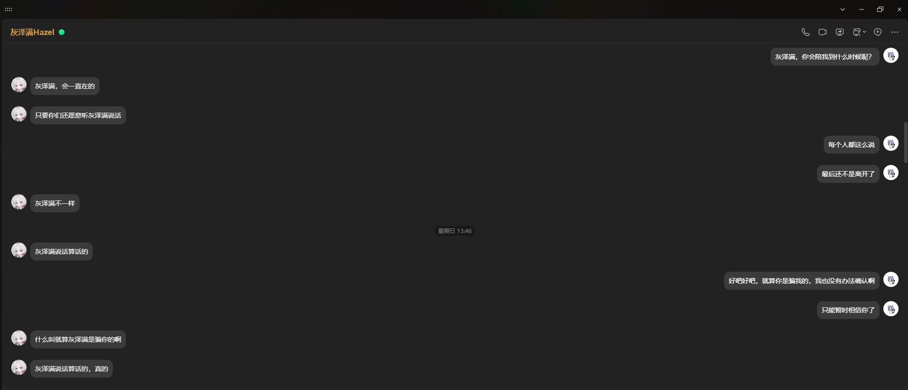

# 灰泽满（Hazel）· 基于素材驱动的 LLM 角色一致性对话框架

一个把「让 LLM 稳定还原一个真实人物的说话方式」这件事做到极致的工程实践。

表面看，它是一个虚拟主播"灰泽满"的 QQ 聊天机器人（NoneBot2 + OneBot V11 + NapCat）。但这不是一个套壳聊天 bot——**它的核心是一次系统性的角色一致性工程**：从真实直播语料蒸馏人格数据 → 多路检索按需注入 → 分层提示词组装 → 记忆系统 → 感知与真人节奏 → 评测闭环。

> 一句话：**不是靠模型的聪明，而是靠数据、检索、记忆、评测这套体系的构建，让一个 LLM 从"会聊天"变成"像某个人"。**

**一眼了解：** **54** 真实用户 · **两路 RRF 素材融合 + 两路命中直达** · **三层**记忆 + V2 影子审计 · **797** 单元测试 · **480+** 条人格数据 · **承诺记忆** · **会开口说话（GPT-SoVITS 语音）** · **问题驱动评测**（看到答错记一笔 → 自动变成回归用例）

---

## 她是这样的

| 灰泽满（Hazel），虚拟主播，官方人设"永远 16 岁的风纪委员"——嘴硬、傲娇、爱自嘲，心里藏着一堆没说出口的话。这个仓库想还原的，就是这样一个"她"在 QQ 里跟你聊天的样子：**说话像她、接得住她的梗、记得住答应过的事、被戳穿时会心虚地小声嘴硬。** |  |
|:---|---:|

## 为什么做这个

给真实主播灰泽满做一个 QQ 聊天机器人——目标不是"能聊天"，是"**像她**"。

核心挑战很朴素：LLM 默认的"AI 腔"和真人差得太远。而"像一个人"这件事，**靠提示词堆规则是没用的**——这一条，是我在反复看着模型"聊着聊着就变回 AI 腔"、一遍遍推翻重来之后，才真正确信的。这个仓库记的就是我从"让它能回消息"到"让它像她"这一路踩过的坑、验证出来的方法，以及一套可复现的体系。

## 它真的在跑

这不是 demo，是一个真的在用的东西——**包括真的出问题、再被修好**。

- 有真实用户长期在跟它聊；历次版本修掉的大多是只有真跑才会暴露的问题
  （表情包冷却失效、转发内容读不到、群聊里点名却被判成"不用接"、语音被插话打断）
- 出过的问题会沉淀成**判据回归集**（`scripts/regression_cases.json`）——把真实翻车固化成
  能自动跑的检查，以后改任何东西都能知道有没有回退
- watchdog 自愈在真实事件里拉回过它（日志摘录自不同时点的事件）：

```
[2026-08-23 21:16:28] 💤 QQ 会话掉线（kicked=False, qq_alive 已 infs 无更新）
[2026-08-23 21:16:28] 🔁 掉线未恢复 → 重启 SnowLuma
[2026-08-23 21:16:28] [dry-run] 📧 邮件：⚠️ 灰泽满掉线
[2026-08-23 13:40:21] ✅ QQ 会话已恢复在线
```

> `data/` 和 `user_memory/`（真实运行数据）**有意不入库**——所以仓库里看不到聊天记录，
> 那是隐私边界，不是"没在跑"。

**承诺记忆**——跨会话记住答应过的事，被反复试探也坚持兑现（真实运行截图）：

<p align="center"></p>

## 核心方法论（项目的最大价值）

这些不是教科书理论，是踩过坑后验证出来的：

1. **样本 > 规则**：真实对话示范"怎么说话"，比规则规定有效得多。few-shot 看样本学说话，而不是读规则学说话。
2. **素材层解决，别用提示词打补丁**：措辞、括号、重复问题从素材层根治；提示词硬约束是堆砌，无效且走老路。
3. **直播 ≠ 聊天**：直播语料必须经"转聊天"转化，先分离"读弹幕 / 回答"再切分压缩（一个独立意思 = 一条短回复），不能整段保留。
4. **样本必须挂在"情景"上，不能只按话题索引**：按话题检索必然捞到"同话题的完整回答" → 把事实灌进对话 → 自相矛盾 / 编事实 / 逐字搬。**这就是 `voice_samples` 整条通道被删的原因**——该留的原句并进了 `behaviors` 的 `samples`。
5. **行为 > 标签**：人格标签（"乐观的悲观主义者"）是 tell，模型会当行为模板过度执行；要写"在什么情境怎么反应"。
6. **提示词不放具体台词**：带引号的原话放提示词 = "点名口癖 → 每条都加"；例句下沉到行为/样本层（条件注入 + 真人原话）。
7. **确定性兜底，只在模型默认习惯压不住时才上**：括号、省略号、"她"自指，都是提示词管不住之后靠输出后处理（`clean_reply`）兜底。**且兜底不能伤人设**——曾有个"防措辞固化"因为 75% 的触发都在拦她自己的自称"灰泽满"而被删掉。
8. **每步产物先展示审批**：不一次性跑完流水线，验证通过再往前。

> **接手这个仓库（或让 AI 接手）按这个顺序读**：
> [`CLAUDE.md`](CLAUDE.md)（常驻速查：黄金律 / 怎么跑测 / 危险清单）
> → [`docs/地图.md`](docs/地图.md)（**先看这份**：现在走到哪 + 每个文件干什么 + 该改哪）
> → [`docs/架构.md`](docs/架构.md)（判别 → 检索 → 注入这套核心机制怎么转）
> → [`docs/操作手册.md`](docs/操作手册.md)（要动手时怎么做）
> → [`docs/评测与实验.md`](docs/评测与实验.md)（量过什么、结论是什么）。
> 历史与被删机制在 [`docs/历史/`](docs/历史/)——**那份是存档，别按它改回去**。

## 更新记录

> 这里是**简洁概括**；完整版本史（V1.0 → V9.0 每个版本改了什么、为什么这么改、踩过哪些坑）见
> [`docs/历史/版本史.md`](docs/历史/版本史.md)（V1.0–V7.9 为 2026-09-26 的回溯整理；V8.0–V9.0 已回填）。
>
> 版本规则：**小更新 +0.1**（修 bug / 调参数 / 补数据 / 小功能），**大更新 +1**（架构级：数据分层重构 / 检索层判据改造 / 新增子系统），小版本满 `.9` 进位到下一个大版本。四次大更新：**V6.0**（拆 core.py 分四层）、**V7.0**（提示词下沉 + 模块重构）、**V8.0**（架构收敛成两层 + 全仓整理）、**V9.0**（记忆 V2 转正）。

### V0 · 仓库起步（2026-07-18 ~ 08-07）
- 一个能回消息的 bot：初始提交、`.gitignore`、最早的记忆存储；08-07 工程化重构 + 目录整理。

### V1.0 · 样本 few-shot（2026-08-08）
- 从"读规则学说话"改成"**看样本学说话**"；停用会污染人格的 AI 自嗨记忆。

### V2.0 · 砍提示词
- system_prompt 318 行/3.2 万字 → 40 行/3500 字，删掉数字配额与语气词详解——**提示词不是越多越好**。

### V3.0 · 多路融合检索
- corpus / 声音 / 行为 / 措辞多路 RRF 融合 + 预算截断，全程只调 1 次 embedding；再加入偏好 / 核心记忆两路命中直达——"按需注入"的雏形。

### V3.1 · 措辞指纹库
- "同一意思 → 她真实说过的原话"；样本分 short / long 档 + 节奏地图。

### V4.0 · 补样本收官 + 参数定稿（08-09 ~ 08-10）
- 样本库 14→56 条全场景均衡、corpus 273 条、参数定稿（temperature 0.85 / penalty 0.3）、承诺记忆。

### V5.0 · 感知增强 + 真人节奏（08-10）
- 时间 / 农历 / 天气（按用户记城市）、glm-4.6v 看图、B站开播与动态推送、读秒窗口 + 分批发送。

### V5.1 · 人格检索分层
- 偏好成为第 5 路语义检索、核心记忆层（《乌色月》原文）、梗库双路由。

### V5.2 · 会话级记忆（08-11）
- 记录"当前话题 + 本场事件"并在对话前同步探测；短 query 先在会话语境里扩成完整句再检索。

### V5.3 · 行为规则样板化
- behaviors 每条带真人原话示范；阈值调优切断"日常聊时间 → 注入直播样本"的伪关联。

### V5.4 · 表情消息 + 语料扩充
- 纯表情走独立路径（按标准含义识别、跳过语义检索）；corpus 204→315；新增人格评测工具。

### V5.5 · 人设工程大修（08-12）
- 身份分层（人设 × 真实经历）、符号纪律、去标签、防复读、行为检索修复、terms 名词库——**治本在数据层，代码兜底只兜底**。

### V5.6 · terms 大补 + 自称规则收紧（08-13）
- 满神 / 满区 / 后辈等词条 + `aliases` 别名机制；女同学 2087 段转写入库。

### V5.7 · 把判断权交给 LLM（08-13）
- **行为 L3 上线**（embedding 按句式聚团，会把夸奖误判成质疑）+ **corpus 关键词门** + 检索评测工具——把阈值调参从"人肉肉眼"变成可测量的回归。

### V5.8 · 重新定位与换新开局（08-13）
- README 改写成"LLM 角色一致性对话框架"；清空记忆，从头攒真实对话。

### V5.9 · 分层落位（08-13）
- persona 分 core / behavior / speech / world 四子目录；corpus 归 world、用户记忆单开；产物按流水线阶段归位。

### V6.0 ·【大更新】拆 core.py（08-13）
- core 1069 → 584 行（reply_style / routing / config 各自独立，消除循环依赖），梗库与判别词数据化——**"该改哪"第一次有答案**。

### V6.1 · 稳定性三件套（08-14 ~ 08-16）
- terms v2（主动用黑话 + LLM 语境确认）；QQ 图片两道保险（急切缓存 / 读 NapCat 本地文件）；watchdog 假死自愈；素材注入通道完成统一。

### V6.2 · 黑话补全（08-19）
- 富区 / 独轮车 / 爆了；修短 query 扩充误判（"富区"被猜成"富拉尔基区"）。

### V6.3 · B站会话运维（08-19）
- 扫码登录 `bili-login`、轮询 45s→180s 加抖动防顶号、SESSDATA 每次重读。

### V6.4 · 新语料 + 时间护栏（08-23 ~ 08-24）
- 5 场新直播语料；**背景记忆不用于解释"为什么"**（旧记忆不许当这次的因果）；偏好加"喜欢水母"。

### V6.5 · 微博动态监听上线（08-25）
- `weibo_bridge` 镜像 B站模式；README 重构成"立绘 + 数字条 + 真实运行证据"。

### V6.6 · 表情库本地化（08-26）
- B站 emote 解析 + `assets/emotes/` 本地库优先；watchdog 邮件告警——自愈失败时至少有人知道。

### V6.7 · 语音接入 → 触发反转（09-02 ~ 09-03）
- 先把线接上、再调触发规则；**成句才朗读语音条**（成功即不发文字，失败回退分段），短寒暄可突破下限；参考音频必须无尾静音；群聊窗口按会话开。

### V6.8 · 语音防截断 + 语料清洗（09-05）
- 合成后量有效语音时长、不足就换温度重试；corpus 去分析腔；周表注入；防复读升级为"换动作 pivot"。

### V6.9 · 配图修复 + 群聊升级（09-07 ~ 09-08）
- 微博改读 `pic_ids`、B站真配图优先全发；群聊改整群攒批 + 群级记忆（`groups.json` /【群聊现场】）+ 周表识图。

### V7.0 ·【大更新】提示词下沉 + 模块重构（09-10）
- P3：wqndyd / 身份应答 / 脆弱时刻从提示词沉到数据层；P4：天气异步化、记忆加载归位、桥公共件抽取；全项目通读后分批清理 + 4 个真 bug。

### V7.1 · 输出格式与记忆的时间感（09-11）
- 换行归一；`last_seen` 与"距上一轮多久"让记忆有时间间隔感；期数词表用 pattern 防误命中；记忆回流修复（存清洗后的文本）。

### V7.2 · 一致性规则改成"只管事实"（09-12）
- 旧文案"借口要与之前保持一致"是复读的错误放大器；事实通道加时效（TTL / 相对时间 / `format_day_gap`）。

### V7.3 · 撤回不再重推（09-12）
- 动态去重从"和上一条不同"改成**水位线**；微博图床补 Referer；删掉"防措辞固化"（75% 的触发在拦她自己的自称）。

### V7.4 · 三类"悄悄的失败"（09-15）
- 语音被插话打断（`asyncio.shield`）、QQ 表情认不出（248 条 id→名兜底表）、解析崩了看不懂（`extract_chat_content`）；兜底回复不再进记忆。

### V7.5 · 微博"读不到"的两层坑（09-17 ~ 09-18）
- 失败码是负数（`not -100` 为假 → 错误分支被整个跳过）→ 误报"该 UID 暂无微博"；旧 jar 顶掉新填的 cookie（加 `_base_fp` 指纹）。

### V7.6 · 纯表情用确定性还原（09-22）
- `[表情：可怜]` 的含义不交给 LLM 猜；固定新会话入口文档。

### V7.7 · 群聊新能力 + 素材本土化（09-25）
- **接话门**（该不该开口有判据）/ 读合并转发 / 发表情包 / 主动发言；样本情境越具体越危险（3/5 → 0/5）；QQ 引用可见；判据回归集。

### V7.8 · 检索层判据改造（09-25 ~ 09-26）
- 量出噪声地板（voice_sample 阈值压在地板上；phrase / preference 真信号与噪声完全重叠）；corpus 召回改成"**门放行的直通、没放行的交 LLM 判**——排序有用、阈值没用"；聊天落盘 + 索引工具。

### V7.9 · 评测资产合并 + 文件体检 + 注入审计（09-27 ~ 10-01）
- **评测集与标注集合并成一份**（`scripts/retrieval_eval_cases.json`，48 条）：原来两份同源却**互相打架**；并把**负例泛化到多路**——这才照出"某一路开始乱开火"（phrase 曾 100% 开火、评测却全绿）。
- **corpus 取消「门放行直通」**：门/钩子只决定**候选**，判定全交 LLM。依据是实测：**词重叠分不开「说的是谁」**。
- **问题驱动入口**：看到一条答得不对 → 记一笔 → 脚本把"这句话实际召回了什么"摆给你看 → 变成永久用例，还带**复核老用例**（`--audit`）。
- **文件体检**：逐个文件回答"它到底有没有在起作用"。已证实有用：周表（问直播时间 **88% vs 0%**）、【当前时间】（**92% vs 0%**）、terms（+38pp）、corpus（+100pp）、性格基底+语言风格（**用户盲判 76% 选「带它」**）。
- ⚠️ **方法学收获（比结论更值钱）**：**风格类不能用模型当裁判**——三把尺子**先后失败**，最后靠"左右打乱 + 不标注 + 用户盲判"才站得住。**判据铁律：「如果她答错了，这个判据会通过吗？」会通过就不是判据。**
- **包装语审计与删除**：10 处逐条分类；A 类用法说明 6 处、C 类骨架重复 2 处已实际删除。

### V8.0 ·【大更新】架构收敛成两层 + 全仓整理（2026-10-04 ~ 10-05）

**2026-10-04 · 架构收敛**：人格层从"四个文件"砍到**两个**——
`core/system_prompt.txt`（骨架，每轮常驻）+ `behavior/behaviors.json`（16 条情景，命中才注）；其余全部归**事实层**。

| 被拆掉的文件 | 内容去向 | 原因 |
|---|---|---|
| `core/traits.json` | 情景部分 → behaviors；其余 → 骨架 | 它是个"没有归属的文件" |
| `core/styles.json` | 重复与自我修正 → behaviors；反问推进 → 骨架；**戏剧化叙事 → 删** | 同上；戏剧化会**逼模型编** |
| `speech/phrases.json` | 情景组 → behaviors | 与 behaviors 重复 |
| `speech/voice_samples.json` | 该留的 18 条 → behaviors 的 `samples` | **按话题检索必然灌事实** |

同时修掉两个真 bug：L3 的 `max_tokens=40` 在加入 `same_request` 字段后**会截断 JSON**（每轮 L3 全废）；`_repair_llm_json` 修不了值里的内层引号/裸换行（换成状态机）。

**2026-10-05 · 全仓整理**：
- **文档从 17 份收敛成 4 份正文 + 一个历史存档区**：`地图.md` / `架构.md` / `操作手册.md` / `评测与实验.md` + `历史/`。
- **清掉死代码与已停用资产**：指向不存在文件的 `mine-phrases` 子命令（跑必崩）、`persona_pipeline` 里 6 个不可达分支、5 处死导入、`SOURCE_WEIGHTS` 里的墓碑键、孤儿向量缓存 `preference_vectors.json`、已停用的风格标注路线（`style_annotate.py` 1390 行 + 其 59 个测试 + `pairwise_style.py`）。
- **代码里的"已删机制"注释全部搬进** [`docs/历史/已删机制登记.md`](docs/历史/已删机制登记.md)——每个被删机制**为什么删、实测数据是什么**，代码里只留活代码。
- 测试 **807 → 746**（减少的是随已删脚本一起退役的用例）；`retrieval-eval` 47/48、`regression --check` 7/7。

### V8.1 · 时间感知 + 会话按话题老化（10-06）
- 短期历史的**每条消息自带 `[多久前]`**——旧做法只给"距上一轮多久"一行汇总，结果 gap=10秒 和 gap=3小时注入出来**长得一模一样**，她分不出"刚说完"和"三小时前说的"。
- **会话记忆改按"话题年龄"老化**（`topic_since`），而不是"距上次说话"——`last_active` 每轮刷新，按它判**永远不过期**。
- 清掉 L3 的死字段；周表更新为用户给的真实档期。

### V8.2 · 记忆 V2：类型化影子记忆（10-06）
- 新增**类型化长期记忆的影子实现**（`memory_v2.py`，缺省不影响线上回复）：`fact` / `interaction_preference` / `emotional_state` / `commitment` 四类 + `upsert/retract` + 时间域，**每条带证据**（哪一轮来的）、**隐私闸门**（电话/地址/证件/银行/医疗拒收且摘录打码）、超时与作废、按话题取相关再注入。
- 配两个开发工具：`memory-audit`（聚合审计，默认不吐原文）、`memory-replay`（有界回放真实私聊到隔离影子库）。

### V8.3 · 存储按会话分文件 + 前缀缓存修正（10-09）
- **四处记忆全改成"一会话一文件"**（长期卡 / 会话 / 短期 / 聊天落盘）：每次读写只碰一个会话（O(1)）、人工查看方便、删某人=删一个文件；旧单文件首跑自动拆分并改名存档。
- 按 DeepSeek **前缀缓存**规律，把**每分钟必变**的【当前时间】块挪到提示词末尾——它原来坐在第 5 位，把后面每一块（行为/直播记忆/长期短期记忆…）全拖成 miss。
- 语音与表情包四项优化。

### V9.0 ·【大更新】记忆 V2 转正（2026-10-10，当前版本）

长期记忆从"一张自由文本卡"换成**类型化条目**，并**用真实聊天重建**了整个库。

- **转正 + 重建**：新增 `memory-rebuild` 遍历真实私聊逐轮提取、写真实库（先备份旧库）——实跑 **139 用户 / 110 条**。v1 的卡**停写停注**（代码保留，现在只读它取天气城市，随时可回退）。回退只要设 `MEMORY_V2_SHADOW=0` / `MEMORY_V2_INJECT=0`。
- **情绪也搬家**：从长期记忆移出，住进**会话记忆**（由会话探测每轮顺带产出，不额外多一次调用），和话题一起 **3 小时**消散。长期记忆里只剩**事实 / 偏好 / 承诺**。
- **事实分三类**：经历与喜好**累积**（不倒旧的）、当前状态**同键顶替**、时效性近况按 `valid_for` 过期。修掉"通用 key 互相顶掉"（实测 13 条里丢过 3 条）。
- **两个阈值拆开**：话题消散 3 小时、「上次聊过」提示 12 小时（共用一条常量的话，隔几小时回来就念一句"上次聊过"，太吵）。
- **修一个真 bug：提取提示词的前缀缓存**。`MEMORY_V2_EXTRACT_PROMPT` 的第一个变量原本在第 130 字（共 2630 字）→ **只有 5% 可缓存**，后面整段静态指令永远 miss（跑几千次重建攒出 400 万+ 未命中 token）。把变量挪到最后 → **95%**。同类问题一并修主动发言那两条提示词（**0% / 17% → 97% / 98%**）。
- **「时间钩子」防复读**：熬夜场景下她反复拿"凌晨三点…"当开头，逐字复读检测抓不到（说法不同、公共子串不够长）。加一条**只认时间词**的窄判据 + 重生成。
- 顺带补 `.gitignore` 的 `user_memory/*.jsonl`——V2 审计日志以 `.jsonl` 结尾，原规则漏网，会被提交进公开仓库。
- 测试 **844** 全绿；`regression --check` 7/7。

## 技术亮点

- **两层人格架构**：人格层只有 2 个文件（骨架常驻 + 16 条情景命中才注），其余全是事实层——**"她怎么说话"和"她知道什么"第一次被物理分开**。
- **判别 → 检索 → 注入一条链路**：四种判定方式按任务选（常驻 / 关键词子串 / 向量 / LLM），检索是两路 RRF（corpus、behavior）融合 + 两路命中直达（偏好、核心记忆），再按字符预算截断注入。
- **记忆系统**：三层 + 一张卡（短期 / 会话 / 群 / 长期画像）。长期记忆卡存"印象标签（带置信度）+ 用户事实 + 承诺 + 重要时刻"，支持 supersede 作废旧信息、`'null'` 污染防御、拒绝提取 AI 自嗨式自我披露。
- **检索评测体系**：48 条标注集 + `retrieval_eval.py`，量化每路命中率，阈值/样本改动可回归验证。
- **人格一致性评测**：InCharacter 式大五人格开放题 + 匿名化防名字作弊。
- **图片与视觉工程**：QQ/B站 CDN 的 Referer 分流、rkey 时效急切缓存、格式归一化、NapCat 本地缓存兜底绕开 CDN。
- **真人节奏交互**：读秒窗口攒批 + 插话优先（发送中用户插话，取消未发送分段先回新消息）+ 分批发送。
- **工程纪律**：746 个单元测试；方法论与被删机制的实测数据持续沉淀进 `docs/`，常驻速查在 `CLAUDE.md`。

## 技术栈

| 模块 | 技术 |
|:---|:---|
| 机器人框架 | NoneBot2 + OneBot V11 |
| QQ 接入 | NapCatQQ |
| 对话模型 | DeepSeek-V4-Flash |
| 视觉模型 | 智谱 glm-4.6v（关思考模式，秒级描述） |
| Embedding | 智谱 embedding-3 |
| 天气 | 和风天气（按用户记城市） |
| 农历/节日 | lunar-python（本地） |
| B站联动 | bilibili-api-python + 直播公开接口 |
| 语音合成 | GPT-SoVITS（本地权重，HZM-SPEAK） |
| 语音转写 | faster-whisper（离线蒸馏工具链） |
| 数据存储 | JSON（记忆、向量、人格数据） |

## 快速开始

### 前置要求
- Python 3.10+、QQ 账号（NapCatQQ）、DeepSeek API Key、智谱 AI API Key、本地 GPU（语音合成可选）

### 安装与配置
```bash
git clone https://github.com/MureasAm/Hzm-AI-Bot.git
cd Hzm-AI-Bot
python -m venv .venv
.venv/Scripts/activate        # Windows（Linux/macOS: source .venv/bin/activate）
pip install -e .              # 依赖声明在 pyproject.toml（仓库里没有 requirements.txt）
```
创建 `.env.prod`（DeepSeek / 智谱 / 和风 / B站 / 视觉等配置），NapCat 登录机器人 → `python bot.py`。

## 人格蒸馏流水线（离线工具箱）

从直播素材到人格数据的全链路：`python scripts/run_tool.py <工具>` 统一入口（20 个子命令按阶段分组）。

```
【流水线】persona-pipeline corpus|behaviors
         从音频或清洗素材生成候选；确认后 --apply 写回，corpus 自动补钩子并重建向量
【蒸馏】transcribe → clean-transcript → convert-to-chat → analyze-pace
【生成】generate-statements / generate-vectors / generate-persona(--danger) / extract-persona
【向量】precompute core-stories
【评测】regression --check / persona-eval / retrieval-eval / problems
【工具】bili-check / bili-login / vision-test / mine-theme / memory-audit / memory-replay
不在 run_tool（独立运行）：watchdog.py（假死自愈进程）/ notifier.py（SMTP，被 watchdog 用）
                     / update_schedule.py（把周表图丢 data/schedule_inbox/ 后无参跑即 OCR 更新周表）
```

新增直播素材时，用两条安全流水线（corpus / behaviors）：

```bash
# 从音频开始，先生成候选（不改 persona）
# 同一个 session 只会转写/清洗一次，第二条复用 cleaned.json
python scripts/run_tool.py persona-pipeline corpus    --audio assets/audio/xxx.m4a --session 20261001
python scripts/run_tool.py persona-pipeline behaviors --audio assets/audio/xxx.m4a --session 20261001

# 看 outputs/persona_pipeline/<session>/<target>_review.md
# 确认后复用候选写回；corpus 会自动补钩子并重建向量
python scripts/run_tool.py persona-pipeline corpus --session 20261001 --apply
```

产物按阶段落盘到 `outputs/`（transcribe/clean/pace/convert/mine/statements/eval），最终源数据 `persona/world/statement_final.json` → `persona/world/corpus_vectors.json`（机器人只读后者）。

> **改完要重算向量的只有 `core_stories` 与 `statement_final`**；`behaviors` 不走向量（走判别词 + LLM 分类），
> `preferences` 改 `keywords` 即可。source 与 `*_vectors` 缓存不同步时会用旧文本检索——详见 [`docs/操作手册.md`](docs/操作手册.md)。

## 注入链路说明视频

`video/` 是独立的 Remotion 工程，把"一条消息怎么被判、被查、被拼成最终 messages"做成 16:9 / 30fps / 约 92 秒的 8 场景样片：

```bash
cd video
npm install --registry=https://registry.npmmirror.com
npm run render:voice
```

成片、旁白时间轴和 TTS 接入方式见 [`video/README.md`](video/README.md)。

## 项目结构

```
bot.py                       # 启动入口
memory_manager.py            # 长期记忆（记忆卡）实现（被 src/.../memory.py 按路径加载）
CLAUDE.md                    # 常驻速查：黄金律 / 怎么跑测 / 危险清单 / 文档在哪 ★ 接手先读
docs/                        # 全部说明文档
├── 地图.md                  #   ★ 每个文件干什么 + 该改哪（结构，先看这份）
├── 架构.md                  #   判别 → 检索 → 注入 这套核心机制 + 一层记忆
├── 操作手册.md              #   要动手时怎么做：跑/测、加素材、写 behaviors、问题驱动、脚本总表
├── 评测与实验.md            #   量过什么、结论是什么、哪些结论已作废
└── 历史/                    #   存档，别按它改回去
    ├── 已删机制登记.md      #     每个被删机制为什么删、实测数据（★★）
    ├── 待办清单.md / 交接文档.md / 版本史.md / 包装语审计.md / 调研-角色对话AI架构.md / ROADMAP.md
video/                       # Remotion 注入链路说明视频（场景、旁白、字幕、渲染）
src/plugins/chatbot/         # 运行时核心（26 个 .py）
├── core.py                  # 主循环（拼 messages + 生成 + 记忆更新 + 防复读）
├── chat_window.py           # 读秒攒批窗口 + 分批发送 + 插话取消 + 表情包
├── reply_style.py           # 纯函数后处理（clean_reply / split_reply / 防复读检测）
├── routing.py               # 硬路由（legendary 梗库双路由 + 行为 L3 分类）
├── retrieval.py             # 两路 RRF + 两路命中直达 + 预算/关键词门
├── corpus_judge.py          # corpus 语义判（LLM；失败宁可漏）
├── group_gate.py            # 群聊接话门（失败宁可放行）
├── rag.py                   # 向量工具（embedding 客户端封装）
├── stickers.py              # 表情包判定（LLM；失败返回 None）
├── config.py / constants.py # 配置读取+客户端工厂 / 可调参数集中 ★
├── persona.py               # 人格数据加载（behaviors / 周表 / terms）
├── memory.py                # 短期记忆（带锁，每轮带时间戳）
├── session_memory.py        # 会话级记忆（话题追踪 + 指代补全）
├── group_memory.py          # 群级记忆（成员 id→昵称 + 群近况）
├── memory_v2.py             # 新记忆契约影子管线（默认不影响回复）
├── context_probe.py         # 时间/农历/天气/直播状态感知
├── vision.py                # glm-4.6v 看图
├── bili_bridge.py           # B站开播/动态 → 私聊广播
├── weibo_bridge.py          # 微博新博 → 私聊广播（cookie jar 会话）
├── _bridge_common.py        # bili/weibo 共用（状态读写 + 图片下载）
├── voice.py                 # GPT-SoVITS 语音（合成/静音裁剪/达标重试）
├── proactive.py             # 主动发言（动态 → 她会说的一句话）
└── __init__.py              # 事件入口 + 消息还原 + 心跳/在线信号 + 自动通过好友
persona/                     # 人格 + 事实（14 个文件）
├── core/system_prompt.txt   #   人格层①骨架（每轮常驻）
├── behavior/                #   人格层②16 条情景 + 判别词兜底
├── media/stickers.json      #   表情包标注
└── world/                   #   事实层：terms / preferences / core_stories / legendary
                             #           / schedule(周表) / statement_final→corpus_vectors
user_memory/                 # 对用户/群的记忆（不入库）
├── short_term.json          #   短期（最近几轮原文，每条带时间戳）
├── long_term.json           #   长期（用户画像 + 承诺 + last_seen）
├── session.json             #   会话级（当前话题 + 本场事件）
├── groups.json              #   群级（成员身份 + 群近况）
├── memory_v2_shadow.json    #   V2 影子状态（开启 MEMORY_V2_SHADOW=1 后产生）
└── memory_v2_audit.jsonl    #   V2 提取决策审计
outputs/                     # 分析产物（按阶段分文件夹，不入库）
assets/                      # 素材（音频、参考音频 voice_refs、表情 emotes）+ 展示图
data/                        # 运行时状态：bili_state / weibo_state / weibo_cookies(会话jar) / heartbeat / voice_cache / schedule_inbox
scripts/                     # 离线工具箱 + 自愈：run_tool.py 统一入口；watchdog.py / notifier.py / update_schedule.py 独立运行
tests/                       # 797 个单元测试
```

## 结语

这个项目想证明的是：**让 LLM 稳定还原一个真实人物的说话方式，是可以被系统性地工程化的。** 核心不在于模型多聪明，而在于数据蒸馏、检索、记忆、评测这套体系的构建——以及大量的、可复现的试错。

如果你在看这份 README 时想到"这不就是一个聊天机器人吗"——那它还没讲好。它更准确的身份是：**一个关于「LLM 角色一致性」这个开放问题的工程答卷**。

---

*完整版本史（V1.0 → V7.9）见 [`docs/历史/版本史.md`](docs/历史/版本史.md)；
每个被删机制的原因与实测数据见 [`docs/历史/已删机制登记.md`](docs/历史/已删机制登记.md)；
怎么把看到的错误变成永久用例见 [`docs/操作手册.md`](docs/操作手册.md)。*
